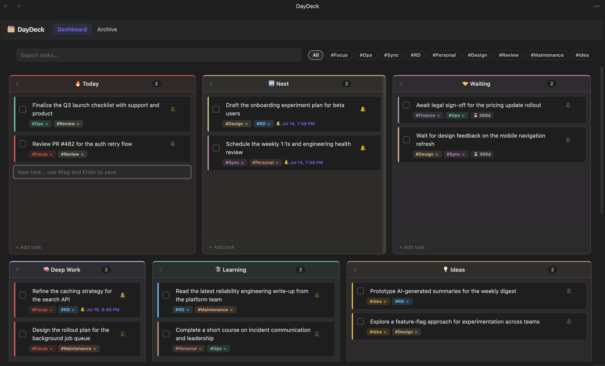
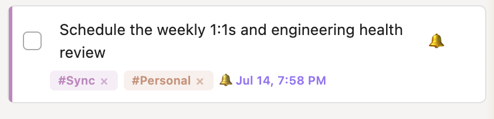

# Docket

**Your day, compiled.**

Docket is a cognitive task management dashboard for Obsidian designed to bridge the gap between **strategic thinking** and **immediate execution**. It replaces traditional linear to-do lists with a flexible, visual multiple group system that adapts to your workflow.

## 🧠 The Philosophy

In the "Two Hat" workflow:

- **Hat 1: The Strategist** - High-level sections (Learning, Admin, Backlog). This is your conceptual workspace where you organize _what_ needs to be done, not _when_.
- **Hat 2: The Operator** - "Today" and "Next". This is your execution engine. Time is the only resource here, so tasks must be specific and actionable.

Docket ensures you never lose sight of the big picture while staying focused on shipping today's work.

---

## 🚀 Quick Start

1. **Install Docket** from the Obsidian Community Plugins store
2. **Open Docket** via the ribbon icon or `Ctrl+P` → "Open Docket dashboard"
3. **Start capturing tasks** using the Quick Capture bar at the top
4. **Organize your workflow** by dragging sections and tasks to fit your needs

---

## 📸 Interface Overview

### Light Mode


### Dark Mode



### Tag Filtering


### Task Reminders



### Section Settings


### Tag Settings


---

## 🌟 Key Features

### 📊 Responsive Section Grid

- **Drag-and-drop sections** (Today, Next, Waiting, Focus Hub, Learning, Ideas, Watch, etc.) to organize your workflow
- **Customizable sections** with unique icons, colors, and widths
- **Resizable sections** - drag the right edge to adjust width (240px-900px)
- **Section descriptions** - add tooltips with purpose and examples for guidance

### ⚡ Smart Capture

- **Quick Capture bar** for instant task entry
- **Inline tagging** with `#tag` syntax to instantly categorize tasks
- **Tag suggestions** appear as you type with keyboard navigation
- **Multi-tag support** - assign multiple tags to any task

### 🏷️ Semantic Tagging

- **Custom tags** with unique colors (e.g., the built-in `#Focus` tag)
- **Tag filtering** via clickable pills in the Quick Capture bar
- **Multi-tag filtering** - combine multiple tags for precise filtering
- **Visual indicators** - task cards show color-coded tag indicators

### ⏰ Task Reminders

- **Date/time reminders** with intuitive pickers
- **Visual highlighting** for overdue reminders
- **Desktop notifications** when reminders are due
- **Date-only reminders** for daily/weekly check-ins

### ⏱️ Waiting Time Counters

- **Track elapsed time** for tasks in waiting sections
- **Enable per-section** - perfect for "Waiting for Review" or "Blocked" sections
- **Automatic formatting** - shows time in human-readable format

### 📦 Archive System

- **Historical ledger** of completed tasks grouped by month
- **Search functionality** to find past completed work
- **One-click restore** to bring tasks back to active sections
- **Task metadata** preserved including tags and completion dates

---

## 🛠️ Installation

### Option 1: Community Plugins (Recommended)

1. Open **Settings → Community Plugins**
2. Disable **Restricted Mode**
3. Browse plugins and search for "Docket"
4. Click **Install** and then **Enable**

### Option 2: Manual Installation

1. **Build the Plugin**:

   - Make sure you have Node.js and npm installed
   - Run `npm install` to fetch dependencies
   - Run `npm run dev` for continuous development mode

2. **Install in Obsidian**:
   - Navigate to your Obsidian vault's plugin folder: `.obsidian/plugins`
   - Copy the entire `docket` folder there
   - Restart Obsidian
   - Go to **Settings → Community Plugins**, disable **Restricted Mode**, and enable **Docket**
   - Click the "Docket" button on your left sidebar to open the view

---

## ⚙️ Configuration

Open the **Docket Settings** tab from the plugin's sidebar menu to customize:

### Sections

- **Rename sections** to match your workflow
- **Change icons** using emoji or short text
- **Adjust order** by dragging sections in the settings
- **Set width** for each section (240px-900px)
- **Choose colors** for visual organization
- **Enable waiting time counters** for sections that track elapsed time
- **Add descriptions and examples** to guide your workflow

### Tags

- **Add custom semantic tags** with unique colors
- **The DeepWork tag** is automatically created for focus filtering
- **Assign colors** to tags for visual distinction
- **Tags appear** as clickable filter pills in the Quick Capture bar

---

## ⌨️ Usage Quick Reference

| Action           | Method                             | Description                            |
| :--------------- | :--------------------------------- | :------------------------------------- |
| Open Docket      | `Ctrl+P` → "Open Docket dashboard" | Opens/focuses the dashboard            |
| New Task         | Type in Quick Capture + `Enter`    | Adds task to active section            |
| Tag Task         | `#tag` in task text                | Assigns a semantic tag                 |
| Filter by Tag    | Click tag pill in Quick Capture    | Filter view to show only tagged tasks  |
| Multi-tag Filter | Click multiple tag pills           | Filter by multiple tags simultaneously |
| Clear Filters    | Click "All" pill or `Escape`       | Remove all active filters              |
| Move Task        | Drag task card                     | Move between sections or reorder       |
| Reorder Section  | Drag section header (⠿)            | Reorder sections on dashboard          |
| Resize Section   | Drag right edge of section         | Adjust section width                   |
| Edit Task        | Double-click task text             | Inline edit with tag support           |
| Context Menu     | Right-click task card              | Access all task actions                |
| Set Reminder     | Click 🔔 icon on task              | Set date/time reminder                 |
| Clear Reminder   | Right-click → Clear reminder       | Remove reminder from task              |
| Delete Task      | Click × on card or context menu    | Permanently removes                    |
| Complete Task    | Click checkbox on card             | Moves to Archive                       |
| Restore Task     | Click "Restore" in Archive         | Moves back to Today section            |
| Archive Search   | Type in Archive search bar         | Filter completed tasks                 |
| Section Info     | Click ℹ️ on section header         | View section description and examples  |
| Edit Section     | Click ✏️ on section header         | Modify section properties              |
| Add Section      | Click "+ Add Section" button       | Create new custom section              |

---

## 💡 Tips & Tricks

### Workflow Optimization

**1. Use the Two-Hat System Effectively**

- Keep strategic sections (Learning, Ideas, Backlog) separate from execution sections (Today, Next)
- Review your strategic sections weekly and move actionable items to Today/Next
- Use the "Waiting" section for tasks blocked on external dependencies

**2. Leverage Tag Filtering for Focus**

- Create tags for different work modes: `#DeepWork`, `#Admin`, `#Communication`
- Filter by `#DeepWork` during focus sessions to eliminate distractions
- Use `#Urgent` for time-sensitive items that need attention

**3. Optimize Section Layout**

- Resize sections based on your typical task volume
- Wider sections for high-volume areas like "Today"
- Narrower sections for reference areas like "Ideas"
- Order sections left-to-right by priority or workflow stage

**4. Use Section Descriptions**

- Add clear descriptions to each section explaining its purpose
- Include 4 practical examples in the section settings
- This helps maintain consistency when adding new tasks

### Task Management

**5. Quick Capture Best Practices**

- Use inline tags when capturing: `Review PR #DeepWork #CodeReview`
- Be specific with task descriptions to make them actionable
- Use the Quick Capture bar as a scratchpad - type and press Enter quickly

**6. Smart Reminder Usage**

- Set date-only reminders for recurring tasks (weekly reviews, monthly reports)
- Use specific time reminders for time-sensitive deadlines
- Overdue reminders are visually highlighted - check these daily

**7. Archive as a Learning Tool**

- Review your Archive monthly to identify patterns in your work
- Use the search function to find similar completed tasks
- Restore tasks when similar work comes up again

### Advanced Techniques

**8. Multi-Tag Filtering**

- Combine tags for precise filtering: `#DeepWork` + `#Backend` for backend focus sessions
- This is powerful for specialized work modes or project-specific filtering

**9. Waiting Time Tracking**

- Enable counters on "Waiting" sections to track response times
- Use this data to identify bottlenecks in your workflow
- Follow up on tasks that have been waiting too long

**10. Section Color Coding**

- Use colors to indicate section types: red for urgent, blue for strategic, green for active
- This creates visual hierarchy and makes scanning faster

**11. Keyboard Shortcuts**

- Use `Ctrl+P` → "Open Docket dashboard" for quick access
- Press `Escape` in Quick Capture to clear filters and blur input
- Use arrow keys to navigate tag suggestions when typing

**12. Context Menu Power**

- Right-click any task to access all available actions
- Move tasks between sections quickly via the context menu
- Toggle tags directly from the context menu without editing

### Maintenance

**13. Regular Reviews**

- Weekly: Review strategic sections and move items to execution
- Monthly: Clean up Archive and review completed work patterns
- Quarterly: Reassess your section structure and tag taxonomy

**14. Tag Hygiene**

- Keep your tag list focused and meaningful
- Remove unused tags periodically
- Consider tag hierarchy (e.g., `#Work/Backend`, `#Work/Frontend`)

---

## 🎨 Customization Examples

### Example Section Layout

```
[Today (400px)] [Next (320px)] [Waiting (280px)] [Focus Hub (350px)]
[Learning (300px)] [Ideas (280px)] [Backlog (320px)]
```

### Example Tag System

- `#DeepWork` (red) - Focus sessions, no interruptions
- `#Admin` (blue) - Administrative tasks, meetings
- `#Communication` (green) - Emails, messages, calls
- `#Learning` (purple) - Study, research, skill development
- `#Urgent` (orange) - Time-sensitive items

### Example Section Descriptions

**Today Section:**

- Description: "Tasks I will complete today. Keep this focused and achievable."
- Examples:
  - "Review PR #123"
  - "Write documentation for API"
  - "Fix bug in login flow"
  - "Deploy to staging"

---

## 🤝 Contributing

I welcome pull requests, bug fixes, and contributions from the community! If you'd like to contribute to Docket, please check out the [CONTRIBUTING.md](CONTRIBUTING.md) guide for details on how to get started.

---

## 🤝 Support

Found a bug or have a feature request? Please [open an issue](https://github.com/ShivrajRath/docket/issues) on GitHub.

---

## ☕ Buy Me a Coffee

If you find Docket helpful and want to support its development, consider buying me a coffee!

[](https://ko-fi.com/raths)
